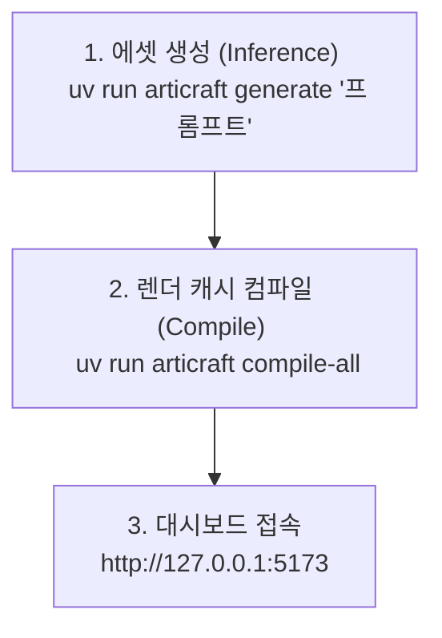

# Articraft 3D 에셋 생성 및 뷰어 활용 가이드라인

본 가이드라인은 Articraft 프로젝트에서 **새로운 3D 에셋(URDF 모델)을 생성**하고, 이를 **3D 뷰어 화면(Web Dashboard)에서 시각화하여 탐색**하는 전체 워크플로우와 CLI 명령어 사용법을 안내합니다.

---

## 🚀 1. 3D 모델 생성하기 (Generation & Draft)

Articraft의 CLI 명령어를 사용하여 프롬프트 기반으로 3D 관절 객체(Articulated Object) 데이터를 생성할 수 있습니다.

### A. 새로운 3D 모델 생성 (AI Inference 실행)
프롬프트를 입력하여 인공지능 생성 런타임을 통해 완전한 3D 모델(URDF, 메쉬 에셋, 파라미터 등)을 빌드합니다.
```bash
# 기본 생성 (GPT 모델 및 기본 설정 사용)
uv run articraft generate "a benchtop monocular laboratory microscope"

# 특정 AI 모델 및 이미지 레퍼런스를 지정하여 생성
uv run articraft generate --model gemini-3-flash-preview --image reference_photo.png "a detailed robotic arm"
```
> [!NOTE]
> 생성된 레코드는 `data/records/rec_<id>` 경로에 저장됩니다.

### B. 가벼운 드래프트(Draft) 생성하기
생성 엔진을 돌리지 않고, 먼저 구조와 프롬프트 사양만 정의한 초안(Draft) 레코드를 생성하여 나중에 디테일 작업을 하고 싶을 때 사용합니다.
```bash
# 드래프트 생성
uv run articraft draft "a complex dual-arm robot workstation"

# 이미지 레퍼런스를 포함한 드래프트 생성
uv run articraft draft --image reference.png "custom gaming desk setup"
```

### C. 기존 레코드 다시 실행하기 (Rerun)
이전에 생성해 둔 기존 레코드를 기반으로 생성을 다시 트리거합니다.
```bash
uv run articraft rerun data/records/rec_<record_id>
```

---

## 📦 2. 뷰어로 보기 전 필수 단계: 컴파일 (Compile & Materialize)

> [!IMPORTANT]
> **새로 생성한 3D 모델을 웹 뷰어(Dashboard)에서 깨끗하게 보려면 반드시 "컴파일" 과정이 선행되어야 합니다.** 
> 이 단계는 로우 데이터(JSON/URDF)를 뷰어의 Three.js 엔진이 읽을 수 있는 캐시 및 렌더링용 에셋으로 재구성해 줍니다.

### A. 단일 3D 모델만 조준하여 컴파일
특정 새로 만든 모델 하나만 골라서 빠르게 3D 에셋 캐시를 빌드합니다.
```bash
uv run articraft compile data/records/rec_<record_id>
```

### B. 전체 3D 모델 일괄 컴파일 (추천 🌟)
뷰어 대시보드를 열기 전에 로컬에 있는 모든 에셋들의 시각화 캐시를 가장 빠르게 대량 구축하는 명령어입니다.
```bash
# 시각화용 렌더링 데이터 일괄 고속 컴파일
uv run articraft compile-all

# 엄격한 검증을 포함하여 원본의 모든 포맷을 검사하며 풀 컴파일
uv run articraft compile-all --target full --strict
```

---

## 🖥️ 3. 3D 뷰어로 탐색하고 관찰하기 (Visualization)

현재 백그라운드에서 실행해 둔 `just viewer-dev`는 Uvicorn API 서버와 Vite 웹 뷰어를 동시에 가동하므로, 전체 3D 모델 대시보드를 모니터링하기 가장 좋은 방법입니다.

### A. 대시보드에서 전체 모델 탐색 (현재 실행 중인 모드)
웹 브라우저를 열고 다음 주소에 접속하면 생성/컴파일이 완료된 모든 3D 레코드 카탈로그를 탐색하고 테스트할 수 있습니다.
👉 **[http://127.0.0.1:5173/](http://127.0.0.1:5173/)**

### B. 특정 모델 하나만 타겟팅하여 단독 뷰어로 실행
대시보드를 통하지 않고, 터미널 명령을 통해 특정 3D 관절 객체(URDF) 렌더링 화면만 브라우저 단독 뷰어로 즉시 실행하는 특수 모드입니다.
```bash
uv run articraft view --dev data/records/rec_<record_id>
```
*이 명령을 실행하면 해당 모델 전용 로컬 서버가 가동되며 웹 화면에 바로 3D 캔버스가 나타납니다.*

### C. 뷰어 검색 인덱스 갱신하기
새로운 모델이 계속 추가된 뒤 대시보드 내 검색창에서 잘 검색되지 않을 때는 인덱스를 빌드해 줍니다.
```bash
uv run articraft workbench search-index
```

---

## 💡 요약 워크플로우 카드
새로운 3D 에셋을 완성하여 대시보드에서 최종 감상하기까지의 3단계 흐름은 아래와 같습니다.


